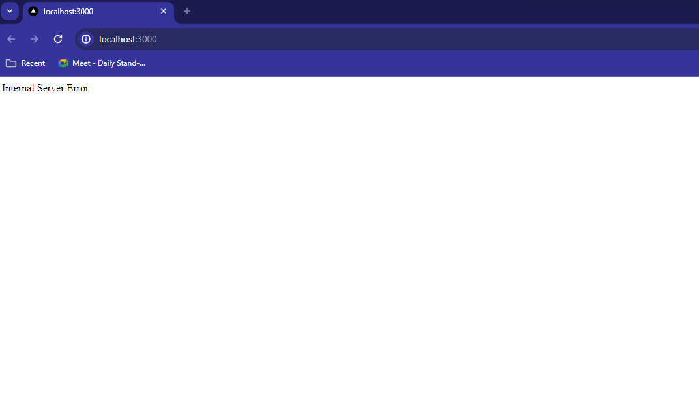

# Simple Turbo Repo reproducing the issue on windows

1. Created from the simple nextjs example on the turbo website

```bash
 pnpm create next-app@latest repro-edge
```

2. Added

```ts
export const runtime = "edge";
```

to `web/app/layout.tsx` and `web/app/page.tsx`

3. Ran `pnpm run dev --filter web`
4. Errors appear

```bash

repro-turbo on  main [!] via  v20.11.0 took 22s
❯ pnpm run dev --filter web

> repro-turbo@ dev C:\Users\fream\Desktop\Projects\repro-turbo
> turbo dev "--filter" "web"


Attention:
Turborepo now collects completely anonymous telemetry regarding usage.
This information is used to shape the Turborepo roadmap and prioritize features.
You can learn more, including how to opt-out if you'd not like to participate in this anonymous program, by visiting the following URL:
https://turbo.build/repo/docs/telemetry

• Packages in scope: web
• Running dev in 1 packages
• Remote caching disabled
web:dev: cache bypass, force executing e6a8ad92b617a942
web:dev:
web:dev: > web@1.0.0 dev C:\Users\fream\Desktop\Projects\repro-turbo\apps\web
web:dev: > next dev
web:dev:
web:dev:    ▲ Next.js 14.1.0
web:dev:    - Local:        http://localhost:3000
web:dev:
web:dev:  ✓ Ready in 1800ms
web:dev:  ○ Compiling / ...
web:dev:  ✓ Compiled / in 2.6s (758 modules)
web:dev:  ⨯ Internal error: TypeError: Cannot read properties of undefined (reading '')
web:dev:     at resolveClientReference (../../node_modules/.pnpm/next@14.1.0_react-dom@18.2.0_react@18.2.0/node_modules/next/dist/compiled/react-server-dom-webpack/cjs/react-server-dom-webpack-client.edge.development.js:53:55)
web:dev:     at resolveModule (../../node_modules/.pnpm/next@14.1.0_react-dom@18.2.0_react@18.2.0/node_modules/next/dist/compiled/react-server-dom-webpack/cjs/react-server-dom-webpack-client.edge.development.js:1588:35)
web:dev:     at processFullRow (../../node_modules/.pnpm/next@14.1.0_react-dom@18.2.0_react@18.2.0/node_modules/next/dist/compiled/react-server-dom-webpack/cjs/react-server-dom-webpack-client.edge.development.js:1648:25)
web:dev:     at processBinaryChunk (../../node_modules/.pnpm/next@14.1.0_react-dom@18.2.0_react@18.2.0/node_modules/next/dist/compiled/react-server-dom-webpack/cjs/react-server-dom-webpack-client.edge.development.js:1751:21)
web:dev:     at progress (../../node_modules/.pnpm/next@14.1.0_react-dom@18.2.0_react@18.2.0/node_modules/next/dist/compiled/react-server-dom-webpack/cjs/react-server-dom-webpack-client.edge.development.js:1819:17)
web:dev: [TypeError: Cannot read properties of undefined (reading '')]
web:dev:  ⨯ [TypeError: Cannot read properties of undefined (reading '')]
web:dev:  ⨯ [TypeError: Cannot read properties of null (reading 'default')]

```

5. Website shows



> [!WARNING] **Note**: This only happens on windows, mac runs fine so does WSL. And this only happens in a monorepo setup, classic NextJS installation is fine

**Windows Information for help**

OS Name: Microsoft Windows 11 Pro \
OS Version: 10.0.22621 N/A Build 22621 \
OS Manufacturer: Microsoft Corporation \
OS Configuration: Standalone Workstation
